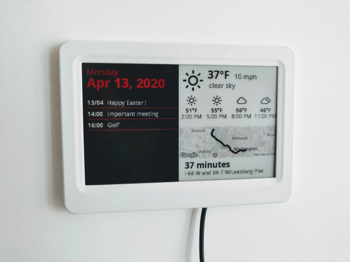

# ESP32 e-Paper

[](images/demo_full.jpg)

## Hardware

This project uses :

- Waveshare ESP32 Driver-Board, $14.99 : https://www.waveshare.com/product/displays/accessories/driver-boards/e-paper-esp32-driver-board.htm
- 7.5inch E-Ink display HAT (B) V1 (640x384), $59.99 : https://www.waveshare.com/product/displays/e-paper/epaper-1/7.5inch-e-paper-hat-b.htm
- 7.5 inch e-Paper case, $4.59 : https://www.waveshare.com/7.5inch-e-paper-case.htm

I had to remove the ESP32 driver headers and cut the case to fit it properly, see [images/inside.jpg](images/inside.jpg)

## Run the server

The server runs on Python. Images are generated using [Pillow](https://pillow.readthedocs.io/en/stable/)
and the web server runs on [AIOHTTP](https://docs.aiohttp.org/en/stable/).

To run the server :

- install the dependencies provided in the `requirements.txt` file (`pip install -r requirements`)
- copy the file `config.example.json` to `config.json`, see the details below
- Run the server using `python run.py --bind 0.0.0.0`

### Run using Docker

A `Dockerfile` is provided :

```
docker build -t epaperserver .
docker run -p "8080:8080" -v "/path/to/my/settings/:/app/config/:rw" epaperserver run --bind 0.0.0.0 --config /app/config/config.json
```

## Settings

See `config.example.json` to see the format.

- The `displays` key contains the list of displays indexed by their ID.
  - `size` : The size of the display in pixels
  - `updateEvery`: The number of seconds to wait between two updates (example: `600`)
  - `settings`: The settings shared by all the widgets
    - `locale`: The language used by the display (examples: `"en_US"`, `"fr_FR"`)
    - `timezone`: The timezone used by the display (examples: `"America/New_York"`, `"Europe/Paris"`)
    - `units`: `"imperial"` or `"metric"`
  - `widgets`: The list of widgets to show on the display
    - `widget`: The id of the widget (`"date"`, `"googlecalendar"`, `"googlemaps"` or `"weather"`)
    - `position`: The top left position on the display (example: `"0, 68"`)
    - `size`: The size of the widget (example: `300x316`)
    - `settings`: The widget-specific settings
- The `tokens` key contains the tokens of the clients with their matching display id.

### Widgets

#### googlemaps

Shows a map between home and work with the current fastest route, and its time.

The settings are :

- `home_address`
- `work_address`
- `client_key`: The Google Maps API client key. Please follow the instructions provided [here](https://developers.google.com/maps/gmp-get-started#quickstart) to get a key (free up to $200 per month)

#### weather

Display the weather in your city.

The settings are :

- `api_key` : Sign up [here](https://home.openweathermap.org/users/sign_up) to get a key (free)
- `city_id` : The numerical ID of your city on [openweathermap.org](https://openweathermap.org/)

#### googlecalendar

Displays today's event from your Google Calendar.

Settings :

- `credentials` : The path to the `credentials.json` file, see below
- `token_store` : The path to the `token.pickle` file, see below

This widget uses the Google Calendar API to fetch data from your calendar. Follow the instructions [here](https://developers.google.com/calendar/quickstart/python)
to create enable the API (free up to $200 par month) and get the `credentials.json` file.

The `token.pickle` file stores the OAuth2 tokens linked to your account. The create this file,
simply set its path in the settings file and launch the project *locally*. The service will open
a web page to authorize your account. This will only happen once, make sure to store the file
properly. 

#### date

Displays the current date on a black background.


## Compile the firmware

Open the `epaper-esp32` using PlatformIO. Copy the file `include/settings.example.h` to `include/settings.h`.

You can then deploy the project on you ESP32. The firmware uses ESP-IDF 4.0.

## Misc.

### Optimizations/protocol

#### Don't refresh the display when is not needed

The servers returns a header `ETag` containing an id of the image. This id is stored by
the client and sent on each request.

If the image did not change since the previous request, the status code returned will
be 304, so that the clients knows it should not update the display.


#### Don't request the server too frequently

The data is updated according to the `updateEvery` setting. Each request for the image returns
a header `Cache-Control": max-age=XXX` containing the number of seconds until the next request,
plus 20 seconds.

This allows the client to sleep the time required, and request the next image only when it
would be updated.

### Notes

- Conversion of SVG to monochrome PNG for the weather : `mogrify -format png -flatten -density 300 -monochrome *.svg && mogrify -format png -auto-level *.png`

### Attribution

- Weather icons : https://github.com/erikflowers/weather-icons
- LodePNG : https://lodev.org/lodepng/


## Troubleshooting

```
In file included from src/epd.c:1:0:
include/epd.h:8:21: fatal error: lodepng.h: No such file or directory
```

You're probably running an outdated version of framework-espidf. Try running `pio update`.